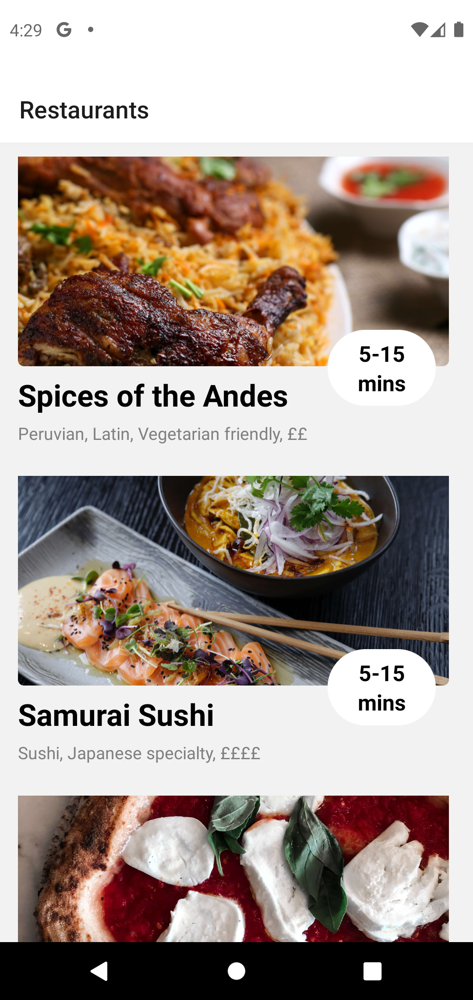

# React Native Uber Eats Frontend Clone

This is a simple frontend clone of Uber Eats built using React Native, Expo, and React Native Navigation.


---
## Screenshots

Homescreen                   |Food menu
:---------------------------:|:---------------------------:
|

---
## Installation

To install the app, you will need to have Expo CLI installed. You can install it by running:

```npm install -g expo-cli```

Then, clone the repository and install the dependencies by running:

- ```git clone https://github.com/Ezema/React-Native-Uber-Clone.git```
- ```cd React-Native-Uber-Clone```
- ```npm install```

## Usage

To start the app, run: ```npm start```

This will start the Expo development server and open the app in your default browser. From here, you can either run the app in a simulator/emulator or on a physical device by following the instructions on the Expo development server page.